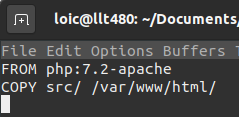
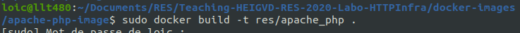

# RES - Labo HTTP Infrastructure

Auteur : Lièvre Loïc
Date : 28.05.2020

## Introduction

## Step 1: Static HTTP server with apache httpd

## Step 2: Dynamic HTTP server with express.js

## Step 3: Reverse proxy with apache (static configuration)

## Step 4: AJAX requests with JQuery

## Step 5: Dynamic reverse proxy configuration