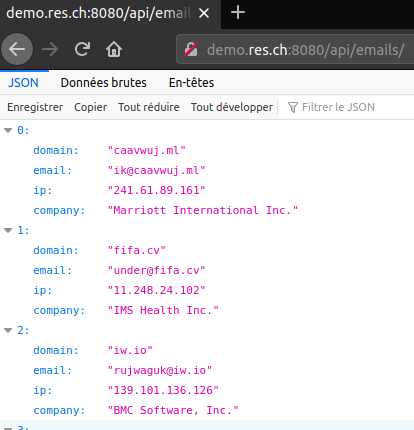

# RES - Labo HTTP Infrastructure

Auteur : Lièvre Loïc

Date : 28.05.2020

## Introduction

## Step 1: Static HTTP server with apache httpd

### Image docker

On crée le fichier Dockerfile avec le contenu suivant afin de configurer notre image Apache avec PHP-7.2.

```
FROM php:7.2-apache
COPY src/ /var/www/html
```

On crée l'image à l'aide la commande `docker build -t res/apache_php`

### Lancement du container

On exécute le container docker à l'aide de la commande  :

`docker run -p 9090:80 res/apache_php`


On peut voir le résultat en se rendant sur l'adresse `localhost:9090`.

Il est ensuite possible de lancer d'autres containers en utilisant d'autres ports libres.

### Template

Le template installé est `Sb Admin 2` téléchargeable sur le site de bootstrap sur [https://startbootstrap.com/themes/sb-admin-2/](https://startbootstrap.com/themes/sb-admin-2/).

Il a été épuré dans le but d'enlever les exemples de code fourni de base.


## Step 2: Dynamic HTTP server with express.js

### Image docker

On crée le fichier Dockerfile avec le contenu suivant afin de configurer notre image avec node 12.17.0.

```
FROM node:12.17.0
COPY src /opt/app

CMD ["node", "/opt/app/index.js"]
```

On crée l'image à l'aide la commande `docker build -t res/express_emails .`

### Code du index.js

```
var Chance = require("chance");
var chance = new Chance();
var express = require('express');
var app = express();

app.get('/', function(req, res){
    res.send(generateEmails())
});

app.listen(3000, function(){
    console.log('Accepting HTTP requests on port 3000.')
});

function generateEmails(){
    var numberOfEmails = chance.integer({
	min:0,
	max:10
    });

    console.log(numberOfEmails);

    var emails = [];
    
    for(var i=0;i<numberOfEmails;i++){
	var domain = chance.domain();
	var email = chance.email({domain: domain});
	var ip = chance.ip();
	var company = chance.company();
	emails.push({
	    domain: domain,
	    email: email,
	    ip: ip,
	    company: company
	});
    }
	
    console.log(emails);

    return emails;
}
```

### Lancement du container

On exécute le container docker à l'aide de la commande  :

`docker run -p 9091:3000 res/express_emails`

On peut ensuite se connecter depuis notre browser en se rendant sur `localhost:9091` afin de voir les résultats.


On remarque aussi que le container docker affiche les même étant donné que nous affichons les résultats dans le code:


## Step 3: Reverse proxy with apache (static configuration)

### Image docker

On crée le fichier Dockerfile avec le contenu suivant afin de configurer notre image contenant httpd afin de l'installer en reverse proxy:

```
FROM php:7.2-apache
COPY conf/ /etc/apache2

RUN a2enmod proxy proxy_http
RUN a2ensite 000-* 001-*
```

On crée l'image à l'aide la commande `docker build -t res/apache_rp .`

### Fichiers de configuration

#### 000-default.conf

```
<VirtualHost *:80>
</VirtualHost>
```

#### 001-reverse-proxy.conf

```
<VirtualHost *:80>
	     ServerName demo.res.ch

	     ProxyPass "/api/emails/" "http://172.17.0.3:3000/"
	     ProxyPassReverse "/api/emails/" "http://172.17.0.3:3000/"

	     ProxyPass "/" "http://172.17.0.2:80/"
	     ProxyPassReverse "/" "http://172.17.0.2:80/"	     
</VirtualHost>
```

Comme demandé dans le podcast, les adresses IP sont en durs dans la configuration ce qui n'est pas idéal étant donné que les machines peuvent changer d'adresses au redémarrage avec docker et pourraient donc ne plus être accessible.

### Lancement des containers

On lance le container du reverse proxy:

`docker run -d --name apache_rp -p 8080:80 res/apache_rp`

On lance les deux autres containers sans port d'accès afin d'éviter de pouvoir y accéder:

`docker run -d --name apache_static res/apache_php`

`docker run -d --name express_dynamic res/express_emails`

Les machines ne sont pas pas accessibles directement. (Sauf en tapant leurs adresses IP "docker" étant donné que mon OS est Linux et j'ai donc un accès direct aux machines.)

On regarde que la machine n'est pas accessible en ne passant pas par le nom de domaine désigné dans le fichier de configuration `demo.res.ch` et donc apache passe par le fichier `000-default.conf`.


Mais si on utilise le nom de domaine, on passe donc par le fichier `001-reverse-proxy.conf`.

On distingue alors les deux cas, si on passe sur `/` on arrive sur le contenu HTML donné par la machine apache configurée pour servir le contenu statique.


Si on passe par `/emails/*` on arrive sur le contenu généré par node js.



Cette image montre que la machine virtuelle de l'API n'est pas joignable en passant par le port 3000 ou tourne l'application express :


## Step 4: AJAX requests with JQuery

### Modification des fichiers Dockerfile

Les fichiers Dockerfile ont été modifiés dans le but d'installer l'éditeur Emacs afin d'avoir un éditeur de texte puissant pour écrire du code.

#### apache-php-image

```
FROM php:7.2-apache

RUN apt-get update && apt-get install -y emacs

COPY src/ /var/www/html/
```

On reconstruit ensuite l'image avec : `docker build -t res/apache_php .`

#### express-image

```
FROM node:12.17.0
COPY src /opt/app

RUN apt-get update && apt-get install -y emacs

CMD ["node", "/opt/app/index.js"]
```

On reconstruit ensuite l'image avec : `docker build -t res/express_emails .`

#### apache-reverse-proxy

```
FROM php:7.2-apache
COPY conf/ /etc/apache2

RUN apt-get update && apt-get install -y emacs

RUN a2enmod proxy proxy_http
RUN a2ensite 000-* 001-*
```

On reconstruit ensuite l'image avec : `docker build -t res/apache_rp .`

### Lancement des containers

`docker run -d --name apache_rp -p 8080:80 res/apache_rp`

`docker run -d --name apache_static res/apache_php`

`docker run -d --name express_dynamic res/express_emails`

On relance ensuite les machines virtuelles comme dans le Step 3. On ajoute ici le paramètre `--ip` dans le but de forcer docker à garder les adresses IP car elles avaient changé. 

Cette configuration d'avoir un reverse-proxy est nécessaire car sinon des problèmes de `same-origin policy` se poserait. En effet, les navigateurs embarquent une sécurité afin de limiter la manière dont un script ou une page peut interagir avec une autre ressources chargée ailleurs.

### Création du fichier emails.js

Le script suivant, basé sur celui du podcast, permet de faire une requête GET pour recevoir sous forme JSON les objets e-mails définis lors de l'étape 2. Le script écrit dans un élément dont l'id est `upemail` et se ré-exécute toutes les 2 secondes.

```
$(function(){
    console.log("Loading emails");

    function loadEmails(){
        $.getJSON("/api/emails/", function(emails){
            console.log(emails);
            var message = "No data";

            if(emails.length > 0){
                var m = emails[0];
                message = m.email + " on server " + m.domain + " with ip " + m.ip + " for Company " + m.company;
            }
	    
            $("#upemail").text(message);
        });
    };

    loadEmails();
    setInterval(loadEmails, 2000);
});
```

### Modification du fichier index.html

Afin de charger le fichier de script précédent il est nécessaire de rajouter deux portions de code.

La première est d'ordre visuel afin d'afficher les données:

```
<!-- Content Row -->
          <div class="row">

            <!-- Content Column -->
            <div class="col-lg-12 mb-12">
              <div class="card shadow mb-4">
                <div class="card-header py-3">
                  <h6 class="m-0 font-weight-bold text-primary">Emails update</h6>
                </div>
                <div class="card-body">
                  <h4 class="small font-weight-bold"><div id="upemail"></div></h4>
                </div>
              </div>
	    </div>
	  </div>
```

La partie la plus importante de ce code est la div dont l'id est `upemail` car c'est dans cet élément HTML que le script précédent va écrire les données.

La deuxième sert à charger le script en lui même qui sera exécuté par le browser: 

```
  <! -- Custom script to load emails -->
  <script src="js/emails.js"></script>
```


## Step 5: Dynamic reverse proxy configuration

Afin de passer de manière dynamique les adresses IP des deux containers et ré-écrire la configuration apache au démarrage du reverse-proxy, il est nécessaire d'écrire des scripts afin de récupérer des variables passées en paramètres à Docker et en faire des variable environnement avec bash pour les récupérer en PHP pour écrire la configuration.

### Script bash apache2-foreground

Le script récupère les adresses IP passées en paramètres par Docker et les passe au script PHP dans le but d'écrire une nouvelle configuration. 

```
#!/bin/bash
set -e

#RES
echo "Setup for RES lab"
echo "Static app URL  : $STATIC_APP"
echo "Dynamic app URL : $DYNAMIC_APP"

php /var/apache2/templates/config-template.php > /etc/apache2/sites-available/001-reverse-proxy.conf

rm -f /var/run/apache2/apache2.pid
exec apachectl -D FOREGROUND
```

### Modification du Dockerfile du reverse proxy

On ajoute la copie des fichiers de configuration et de template.

```
FROM php:7.2-apache

RUN apt-get update && apt-get install -y emacs

COPY apache2-foreground /usr/local/bin/
COPY templates /var/apache2/templates

COPY conf/ /etc/apache2

RUN a2enmod proxy proxy_http
RUN a2ensite 000-* 001-*
```

### Création du script PHP config-template.php 

Le script est exécuté par le script bash dans le but d'écrire une nouvelle configuration dynamique pour apache. Le script récupère les adresses IP depuis les variables d'environnement et écrire la configuration du fichier 001-reverse-proxy.conf.

```
<?php
	$dynamic_app = getenv('DYNAMIC_APP');
	$static_app = getenv('STATIC_APP');
?>
<VirtualHost *:80>
	     ServerName demo.res.ch
	     
	     ProxyPass '/api/emails/' 'http://<?php print "$dynamic_app"?>/'
	     ProxyPassReverse '/api/emails/' 'http://<?php print "$dynamic_app"?>/'
	     
	     ProxyPass '/' 'http://<?php print "$static_app"?>/'
	     ProxyPassReverse '/' 'http://<?php print "$static_app"?>/'
</VirtualHost>
```

### Lancement des containers

On lance quelques containers sans noms afin de montrer que les adresses sont différentes d'avant puis on lance les containers nommés apache_static et express_dynamic  comme avant. Ensuite on démarre le container apache_rp avec la commande suivante en lui spécifiant les adresses IP :

`docker run -d -e STATIC_APP=172.17.0.8:80 -e DYNAMIC_APP=172.17.0.9:3000 --name apache_rp -p 8080:80 res/apache_rp`

Évidement, les adresses IP sont à changer en fonction des containers que nous voulons utiliser.


## Additional steps

### Management UI

Il existe une interface déjà faite appelée portainer qui s'installe très facilement et qui est très pratique.

Toute la documentation se trouve ici : [https://www.portainer.io/installation/](https://www.portainer.io/installation/)

Il na fallu taper seulement 2 commandes pour l'installer:

`docker volume create portainer_data`

`docker run -d -p 8000:8000 -p 9000:9000 --name=portainer --restart=always -v /var/run/docker.sock:/var/run/docker.sock -v portainer_data:/data portainer/portainer`

On peut ensuite y voir nos containers tourner après avoir choisi un mot de passe en se connectant en http sur le port 9000 :

